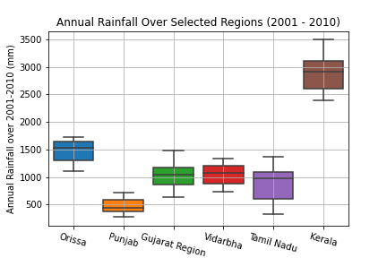
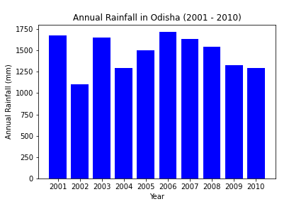

# Data_Visualization_DS200

**Dataset Source** : [link](https://data.gov.in/resource/sub-divisional-monthly-rainfall-1901-2017) (Originally collected by Indian Meteorological Department)

## Scatter Plot

The aim of this plot is to investigate the correlation between amount of rainfall during monsoon season (June to September) as compared to reverse monsoon season (October and November) for the state of Tamilnadu (since it's one of the major states getting rainfall through reverse monsoon).

## Box Plot

This box plot demonstrates the variation in annual rainfall between 2001 to 2010 for certain subdivisions. We also observe that out of the displayed subdivisions, Punjab received the lowest rainfall and Kerala received the highest rainfall for the aforementioned years.

## Bar Plot

The given bar plot displays the variation in annual rainfall between 2001 to 2010 for Odisha.
