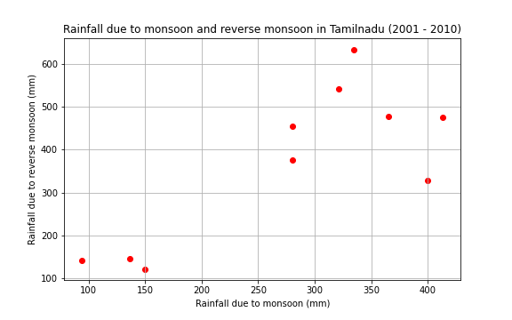

# Data_Visualization_DS200

**Dataset Source** : [link](https://data.gov.in/resource/sub-divisional-monthly-rainfall-1901-2017) (Originally collected by Indian Meteorological Department)

## Scatter Plot

The aim of this plot is to investigate the correlation between amount of rainfall during monsoon season (June to September) as compared to reverse monsoon season (October and November) for the state of Tamilnadu (since it's one of the major states getting rainfall through reverse monsoon).
